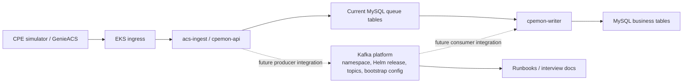

# ADR: Kafka Platform Architecture and Migration Boundary

## Status

Accepted for CCPU-159.

## Context

CPEmon currently has two important runtime concerns:

- business state storage in MySQL
- event buffering through MySQL-backed queue tables

The MVP used this shape because it kept the first demo small and inspectable:

```text
acs-ingest / cpemon-api
        |
        v
MySQL queue tables
        |
        v
cpemon-writer
        |
        v
MySQL business tables
```

Story 8 introduces Kafka as the future event-buffering platform, but the platform should be introduced before application producer and consumer behavior is rewritten.

## Decision

Introduce Kafka as a platform event-buffering boundary first.

The Step 1 Story 8 architecture is:



This means Story 8 owns:

- Kafka namespace
- Helm installation workflow
- topic definitions
- bootstrap and topic config keys
- produce/consume validation runbook
- architecture, migration, observability, and interview documentation

Story 8 does not own:

- Go producer implementation
- Go consumer implementation
- event schema implementation
- deletion of the MySQL queue path
- production MSK migration

## Why Platform First

Changing the runtime event path and introducing a new platform dependency at the same time would mix two risks:

```text
Can we run Kafka correctly?
Can the application publish and consume Kafka events correctly?
```

Those should be validated separately.

The safer migration sequence is:

```text
1. Define Kafka deployment and namespace.
2. Define topics and bootstrap config.
3. Validate manual produce/consume.
4. Document architecture and operational boundary.
5. Add application producer and consumer code in a later story.
6. Retire or reduce MySQL queue behavior only after Kafka integration is proven.
```

## Migration Model

The migration is not a big-bang replacement.

Use this phased model:

| Phase | Event Buffer | Application Behavior |
| --- | --- | --- |
| MVP | MySQL queue tables | Current app writes and worker polling stay unchanged. |
| Story 8 | Kafka platform introduced | App code still unchanged; Kafka platform contract is prepared. |
| Future app integration | Kafka topics | Producers publish events and consumers read events behind config keys. |
| Future hardening | Strimzi or MSK candidate | Broker implementation can change behind `KAFKA_BOOTSTRAP_SERVERS`. |

## Consequences

Positive:

- Kafka platform work can be reviewed without app behavior changes.
- Manual Kafka validation can isolate broker/topic failures from producer-code failures.
- The project gets a clean interview story around migration sequencing.
- The app-facing contract is stable: `KAFKA_BOOTSTRAP_SERVERS` and topic-name config keys.
- A future Strimzi/MSK migration remains a deployment/config change first, not a code rewrite.

Trade-offs:

- Story 8 does not yet deliver end-to-end application events through Kafka.
- MySQL queue tables remain in the application until a later integration story.
- There is temporary dual documentation: current queue path and future Kafka path both exist.

## Interview Answer

I introduced Kafka as a platform boundary before changing application code. The MVP used MySQL queue tables because it needed a small, complete demo. In the cloud upgrade, Kafka is the better event-buffering direction, but I separated platform readiness from application integration. Story 8 proves the namespace, Helm workflow, topics, bootstrap configuration, and manual produce/consume runbook. A later story can add producers and consumers behind the same config keys, then retire the MySQL queue behavior only after Kafka integration is proven.
