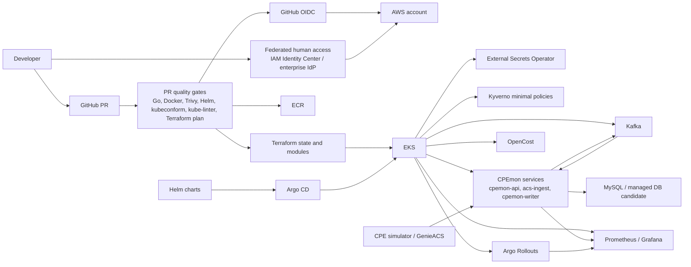

# CPEmon Cloud Platform Upgrade - Step 1 Architecture

Release / Version: Step 1 - EKS GitOps Kafka Platform Upgrade

Status: Draft frozen for implementation planning

## Story Goal

Freeze the Step 1 architecture and define the migration path from the current Kubernetes YAML-based MVP to an EKS-based GitOps platform.

The purpose of Step 1 is not to add tools for their own sake. The purpose is to evolve CPEmon from a lab-friendly Kubernetes MVP into a cloud platform baseline that can support repeatable deployments, pull request based review, managed Kubernetes operations, progressive delivery, security controls, cost visibility, and an event buffer suitable for a telco-style monitoring workload.

## Current MVP Architecture

The current repository is organized as a Kubernetes-first MVP:

```text
app/          Go services: cpemon-api, acs-ingest, cpemon-writer
docker/       Dockerfiles for application images
k8s/          Raw Kubernetes YAML for apps, MySQL, ingress, monitoring, logging, cron, PDB, NetPol
vm3/          GenieACS and CPE simulator stack outside the cluster
sql/          MySQL schema for current status, history, and queue tables
scripts/      Smoke, backlog, backup/restore, ACS demo, and lab helpers
ops/          Runbooks
ADR/          MVP architecture decision records
docs/         Supporting demo and architecture documents
.github/      Existing Go CI and ECR image publishing workflows
```

Current runtime flow:

```text
CPE simulator on vm3
  -> GenieACS on vm3
  -> ingress-nginx
  -> acs-ingest
  -> MySQL ingest_events queue
  -> cpemon-writer
  -> MySQL business tables
  -> cpemon-api / admin UI
  -> Prometheus, Grafana, Elasticsearch, Kibana, Velero/MinIO
```

The MVP already demonstrates meaningful platform ideas:

- Go services with health endpoints and Prometheus metrics.
- Kubernetes Deployments, Services, Ingress, PDBs, NetworkPolicies, and CronJobs.
- MySQL as both business store and simple durable queue.
- Prometheus/Grafana dashboards and alerts.
- Elasticsearch/Kibana logging.
- Velero/MinIO backup and restore demo.
- GitHub Actions for Go CI and ECR image publishing with AWS OIDC.
- Existing ADRs explaining why the MVP chose raw YAML, no Kafka, minimal HA, MySQL, and external vm3 services.

## Current Limitations

The MVP is intentionally clear and reviewable, but the deployment model has limits that Step 1 should address:

- Raw YAML deployment is easy to inspect but hard to reuse across environments.
- Manual `kubectl apply` creates drift risk between Git and the cluster.
- There is no GitOps reconciliation loop to continuously enforce desired state.
- The target cluster is a lab Kubernetes cluster, not a managed cloud Kubernetes platform.
- MySQL queue tables are acceptable for the MVP but are not a strong event buffer for replay, partitioning, or consumer scaling.
- Release strategy is limited to direct image publishing and manual deployment updates.
- Secrets and runtime configuration are embedded or manually managed in several manifests.
- Security governance is mostly implicit; there are no admission policies or image scan gates.
- Cost visibility is limited.
- PR quality gates exist for Go build/test but do not yet cover Terraform plans, manifest validation, image scans, or policy checks.
- There is no formal developer golden path for creating or promoting a CPEmon service change.

## Step 1 Target Architecture

Step 1 establishes a cloud platform baseline:

- AWS EKS as the managed Kubernetes target.
- Terraform for AWS, EKS, IAM, ECR, and platform infrastructure.
- ECR for application images.
- GitHub OIDC for keyless CI access to AWS.
- Federated human access to AWS console/CLI through AWS IAM Identity Center or an enterprise IdP.
- Helm charts for reusable app and platform packaging.
- Argo CD for GitOps reconciliation.
- Kafka for durable event buffering between ingest and writer paths.
- Argo Rollouts for progressive delivery.
- Prometheus and Grafana for metrics, dashboards, and rollout analysis.
- External Secrets Operator for syncing cloud-managed secrets into Kubernetes.
- Trivy scanning for container and dependency security checks.
- Kyverno minimal policies for namespace, image, resource, and security guardrails.
- OpenCost for cost visibility.
- Renovate for dependency and image update automation.
- PR quality gates for Go, Docker, Helm, Kubernetes schema checks, policy checks, and Terraform plans.
- pre-commit hooks for local developer checks.
- kubeconform and kube-linter for Kubernetes manifest validation.

## Target Architecture Diagram

The diagram source is also stored in `docs/cloud-platform-upgrade-step1-architecture.mmd`.



## Migration Path

Step 1 should migrate the MVP in controlled layers:

1. Baseline the current repository with architecture docs, ADRs, roadmap, and a story template.
2. Add Terraform structure for AWS/EKS/ECR/IAM/OIDC without changing application behavior.
3. Convert raw Kubernetes manifests into Helm charts while preserving the existing labels, probes, services, and metrics ports.
4. Add Argo CD Applications so Git becomes the deployment source of truth.
5. Move image build and publish flows to a consistent ECR tagging and promotion model.
6. Introduce Kafka as the event buffer and keep MySQL for business state.
7. Add Argo Rollouts with Prometheus-based analysis for selected services.
8. Add External Secrets Operator and remove hardcoded runtime secrets from app manifests.
9. Add minimal Kyverno policies, Trivy scanning, kubeconform, kube-linter, pre-commit hooks, and Terraform plan checks.
10. Add OpenCost for cost visibility.
11. Document the developer golden path and keep service ownership clear in repo documentation.

## Step 1 In Scope

- AWS EKS platform baseline.
- Terraform modules and environment layout.
- ECR repositories, GitHub OIDC integration, and federated human AWS access.
- Helm packaging for CPEmon services and selected platform components.
- Argo CD GitOps deployment model.
- Kafka development/baseline deployment and CPEmon event flow design.
- Argo Rollouts for at least one CPEmon service.
- Prometheus analysis templates for rollout validation.
- External Secrets Operator integration pattern.
- Trivy scanning in CI.
- Minimal Kyverno policies.
- OpenCost deployment and initial cost dashboard.
- Renovate configuration.
- PR quality gates, Terraform plan on PR, pre-commit hooks, kubeconform, and kube-linter.
- Developer golden path documentation.
- ADRs and roadmap updates.
- Incident drill for current MVP operational risks.

## Step 1 Out of Scope

- Crossplane or platform resource provisioning APIs.
- k8sGPT-assisted operational insight.
- Full self-service developer portal.
- Full multi-account AWS landing zone.
- Full production-grade database migration.
- Full multi-region disaster recovery.

These are intentionally deferred so Step 1 remains a platform upgrade baseline rather than a full internal developer platform.

## Step 2 Placeholder

Step 2 should build on the Step 1 baseline and stay intentionally narrow:

- Crossplane or another control plane API for platform resource provisioning.
- k8sGPT-assisted operational insight.

## Developer Golden Path

A Step 1 developer workflow should look like this:

1. Create a branch from `main`.
2. Run pre-commit checks locally.
3. Update Go code, Helm values, Terraform, or docs.
4. Open a pull request.
5. CI runs Go build/test, Docker build validation, Trivy, Helm lint/template, kubeconform, kube-linter, Kyverno policy checks, and Terraform plan.
6. Reviewers inspect app changes and infrastructure plan output.
7. Merge to `main`.
8. Images are published to ECR with traceable tags.
9. Argo CD reconciles the desired state.
10. Argo Rollouts uses Prometheus analysis to validate selected deployments.
11. Grafana, logs, and cost dashboards provide operational feedback.

## Incident Drill: Current MVP Operational Risks

Drill goal: identify where the current MVP can fail operationally before the Step 1 migration begins.

Failure and risk examples:

- Manual `kubectl apply` causes configuration drift.
- Raw YAML is hard to reuse across dev, staging, and production-like environments.
- No standard release promotion path exists from image build to cluster deployment.
- No progressive delivery gate exists before shifting traffic.
- Secrets and configuration are not cleanly managed.
- MySQL queue tables can accumulate backlog if `cpemon-writer` is down or slow.
- There is no clear replay and partition model for event loss or delayed processing.
- Troubleshooting spans multiple tools manually: kubectl, Grafana, Kibana, MySQL, and scripts.
- Cost impact is not visible during load or scaling demos.

Suggested exercise:

1. Pick one current manifest under `k8s/app` and compare Git desired state with live cluster state.
2. Scale `cpemon-writer` to zero and observe backlog behavior.
3. Review where secrets are defined and how they would rotate.
4. Trace how a new image tag becomes a running Pod.
5. Identify which manual steps Argo CD, Helm, External Secrets, and PR checks would remove.

Expected outcome:

- A short list of migration risks to handle before Step 1 implementation begins.
- Agreement that Step 1 should prioritize GitOps reconciliation, packaging, event buffering, secret management, release validation, and quality gates.

## Validation Checklist

- `docs/cloud-platform-upgrade-step1-architecture.md` exists.
- Step 1 in-scope and out-of-scope items are documented.
- Step 2 placeholder is documented.
- Target architecture diagram is added.
- ADRs are created under `ADR/`.
- README links to this architecture package.
- `docs/cloud-platform-upgrade-roadmap.md` captures Step 1 and Step 2.
- A reusable Jira Story template exists.
