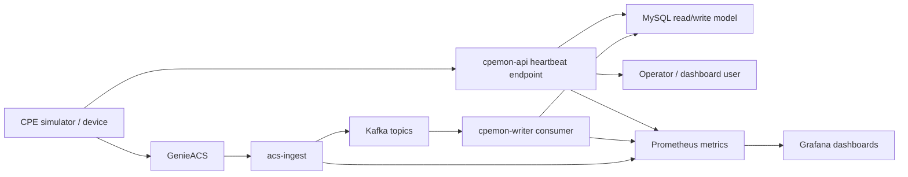
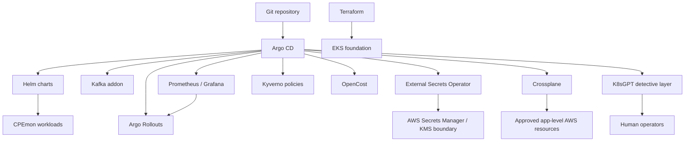

# Final Architecture

## System Flow

## Platform Control Plane

## Decision Map

| Decision | ADR / docs | Evidence |
| --- | --- | --- |
| Terraform owns EKS foundation | `ADR/cloud-platform-upgrade-crossplane-terraform-boundary.md` | `infra/terraform/` |
| Helm packages CPEmon apps | `docs/knowledge/helm-cpemon-application.md` | `deploy/helm/cpemon/` |
| Argo CD owns GitOps reconciliation | `ADR/cloud-platform-upgrade-argocd-gitops-deployment.md` | `k8s/gitops/dev/applications/` |
| Kafka becomes event buffer | `ADR/cloud-platform-upgrade-kafka-platform-architecture.md` | `k8s/addons/kafka/`, app Kafka packages |
| ESO uses AWS Secrets Manager/KMS | `ADR/cloud-platform-upgrade-eso-aws-secrets-manager-kms.md` | `external-secrets.yaml`, runbooks |
| Argo Rollouts provides canary safety | `ADR/cloud-platform-upgrade-argo-rollouts-canary-deployment.md` | AnalysisTemplates and rollout runbooks |
| Governance starts with Kyverno | `ADR/cloud-platform-upgrade-governance-cost-autoscaling.md` | `k8s/policies/kyverno/` |
| Crossplane adds self-service APIs | `ADR/cloud-platform-upgrade-crossplane-developer-self-service.md` | `k8s/crossplane/` |
| K8sGPT adds detective operations | `ADR/cloud-platform-upgrade-k8sgpt-detective-layer.md` | `k8s/k8sgpt/`, K8sGPT runbooks |

## Architecture Boundary

This repo is a platform engineering case study. It contains implementation
artifacts and offline validation. Some runtime behaviors require a real EKS
cluster, cloud credentials, Argo CD, Kafka brokers, and AI backend credentials.
