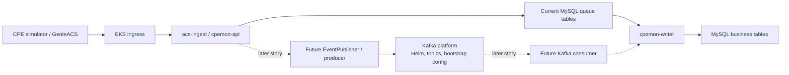

# Kafka Platform Architecture and Migration

## Purpose

This document explains where Kafka fits in CPEmon and why Story 8 introduces the platform before replacing application queue behavior.

Covered task:

- `CCPU-159`: Document Kafka platform architecture and migration decision.

## Current Runtime Path

The MVP runtime path is:

```text
CPE simulator / GenieACS
        |
        v
acs-ingest / cpemon-api
        |
        v
MySQL queue tables
        |
        v
cpemon-writer
        |
        v
MySQL business tables
```

This path is intentionally simple and still valid as the current baseline.

## Story 8 Platform Path

Story 8 introduces Kafka as a platform capability:

```text
kafka namespace
        |
        v
Kafka Helm release
        |
        v
topics and bootstrap config
        |
        v
manual produce/consume validation
```

This prepares the future application event path without changing application behavior yet.

## Architecture Diagram



## Why Kafka Sits Between Ingest and Writer

Kafka belongs between ingestion and downstream processing because that is where CPEmon needs an event buffer.

The platform value is:

- producers and consumers are decoupled
- events can be retained for replay
- consumers can scale independently
- lag becomes observable
- dead-letter handling becomes explicit
- event ownership can be documented through topics

MySQL remains the business data store. Kafka is not a replacement for business tables.

## Why Story 8 Does Not Replace the Queue Yet

Story 8 is a platform introduction story.

It intentionally does not replace the application queue path because that would combine multiple risks:

- Kafka install risk
- topic configuration risk
- application producer risk
- consumer behavior risk
- data consistency risk
- rollback risk

The safer migration is:

```text
platform contract first
manual validation second
application integration later
queue retirement last
```

## Migration Sequence

1. Keep the current MySQL queue behavior as the running baseline.
2. Introduce Kafka namespace and Helm workflow.
3. Define topics, topic naming convention, and bootstrap configuration.
4. Validate Kafka manually with produce/consume commands.
5. Add producer and consumer application code in a later story.
6. Run both paths only if needed for migration validation.
7. Retire or reduce MySQL queue behavior after Kafka path is proven.

## What Changes Later

Later application integration should add:

- `EventPublisher` interface
- Kafka producer implementation
- event schema definitions
- consumer or writer integration
- retry and dead-letter behavior
- application metrics for publish/consume success and failure

Those are deliberately outside Story 8.

## Interview Summary

I did not treat Kafka as a switch to flip inside the application. I introduced it as a platform boundary first. That let me define the namespace, Helm workflow, topics, bootstrap config, and manual validation before touching producer or consumer code. The current MySQL queue remains the baseline until Kafka integration is proven. That is a safer migration story because platform readiness, application behavior, and data consistency are validated in separate steps.
